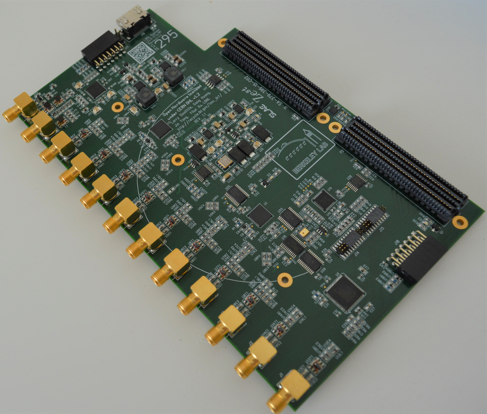

# Zest board

Zest (Z=e^(st)) is a double FMC mezzanine board performing Analog to Digital and Digital to Analog conversions.
This board is mainly used as a part of Radio Frequency (RF) controls electronics systems in particle accelerators.
Over 400 units have been manufactured by Berkeley Lab and SLAC National Laboratories and is the ADC/DAC board base design of the
LCLS-II (Linac Coherent Light Source II) Low-Level RF (LLRF) system at SLAC.

The schematic is in gschem format; to work with it you
need [gschem](http://wiki.geda-project.org/geda:gaf) installed.
Tested on [Debian](https://www.debian.org) Jessie, Stretch, or Buster, where
you simply `apt-get install geda-gschem`.

 

The Zest board features:

* 8 x transformer-coupled inputs sampled at 95 MS/s (2 x AD9653)
* 2 x transformer-coupled outputs sampled at 190 MS/s (AD9781)
* Input clock source up to 3 GHz (LMK01801, no on-board oscillator)
* Extra clock divider output
* 2 x Pmod digital I/O
* Interface to FPGA via dual-LPC-FMC connectors
* 181.8 x 110 mm, 8-layer, with notch to accommodate Xilinx FMC eval boards
* 4W power dissipation


## Schematics

To get PDF versions for reference:

  * Download the `djboxsym` tool. Put it in your PATH.

```bash
$ wget http://www.gedasymbols.org/user/dj_delorie/tools/djboxsym
$ echo "1a372fdef8e474119fae8acde38226f82271b62cd16b7f47b6b2408f0c0dd1ea  djboxsym" | sha256sum -c
djboxsym: OK
```

  * call `make` in `geda_library/symbol/djboxsym/`, which generates symbols from the included symbol templates
  * call `make` in `digitizer/`, which should generate `digitizer_schematic.pdf`

## Artwork/Gerbers

Created by Kathy Pham at SLAC using PADS.  Latest is 20170519.
The PADS design imports the netlist exported from this gschem design.
These PADS files are _not_ kept in this git repository, but
their SHA256 signatures are kept in the
[layout_20170519.sha256sum](layout_20170519.sha256sum) file in this directory.

QR-code serial-number overlay Gerbers are generated with `qr_gen.py`.

## BOM

Get a copy of the `PC-379-396-15-C02_DIGITIZER BOARD_XY.xlsx` file exported from
the PADS design reference above, and place it in this directory.

Then `make merged_xy.csv` to merge the actual orderable part numbers (kept here
in the parts.data file) and get a usable xy assembly file for fabrication.

## Plastic Cover

One corner of the digitizer (by J3, clock input) has some fragile transformers
very close to where SMA wrenches are used.
It has proved helpful to have a protective cover in place to avoid damage.
This is designed in [OpenSCAD](http://www.openscad.org/) with a process that
matches up its features with the Gerber file; see covergen.py.
The OpenSCAD source file is cover1.scad.
OpenSCAD will export an STL file which is easily 3-D printed.

## References

 G. Huang, L. R. Doolittle, J. Yang, Y. Xu,
*"Low Noise Digitizer Design for LCLS-II LLRF,"* in NAPAC2016
[TUPOA40](http://accelconf.web.cern.ch/AccelConf/napac2016/papers/tupoa40.pdf).


## Copyright

Zest Copyright (c) 2019, The Regents of the University of California, through Lawrence Berkeley National Laboratory (subject to receipt of any required approvals from the U.S. Department of Energy), and The Board of Trustees of the Leland Stanford Junior University. All rights reserved.

This documentation describes Zest and is licensed under the CERN OHL v. 1.2.

NOTICE. This documentation was developed under funding from the U.S. Department of Energy and the U.S. Government consequently retains certain rights. As such, the U.S. Government has been granted for itself and others acting on its behalf a paid-up, nonexclusive, irrevocable, worldwide license in the documentation to reproduce, distribute copies to the public, prepare derivative works, and perform publicly and display publicly, and to permit others to do so.

You may redistribute and modify this documentation under the terms of the CERN OHL v.1.2. (http://ohwr.org/cernohl). THIS DOCUMENTATION IS PROVIDED BY THE COPYRIGHT HOLDERS AND CONTRIBUTORS "AS IS" AND ANY EXPRESS OR IMPLIED WARRANTIES, INCLUDING, BUT NOT LIMITED TO, THE IMPLIED WARRANTIES OF MERCHANTABILITY AND FITNESS FOR A PARTICULAR PURPOSE ARE DISCLAIMED. IN NO EVENT SHALL THE COPYRIGHT OWNER OR CONTRIBUTORS BE LIABLE FOR ANY DIRECT, INDIRECT, INCIDENTAL, SPECIAL, EXEMPLARY, OR CONSEQUENTIAL DAMAGES (INCLUDING, BUT NOT LIMITED TO, PROCUREMENT OF SUBSTITUTE GOODS OR SERVICES; LOSS OF USE, DATA, OR PROFITS; OR BUSINESS INTERRUPTION) HOWEVER CAUSED AND ON ANY THEORY OF LIABILITY, WHETHER IN CONTRACT, STRICT LIABILITY, OR TORT (INCLUDING NEGLIGENCE OR OTHERWISE) ARISING IN ANY WAY OUT OF THE USE OF THIS SOFTWARE, EVEN IF ADVISED OF THE POSSIBILITY OF SUCH DAMAGE. Please see the CERN OHL v.1.2 for applicable conditions.
